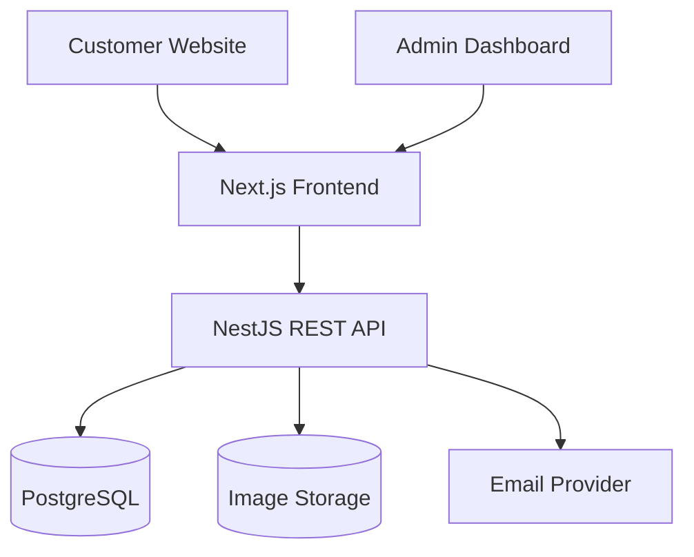
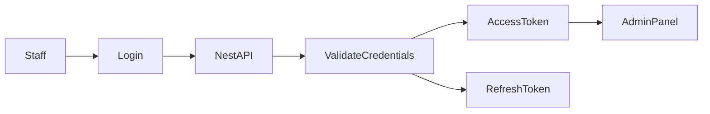
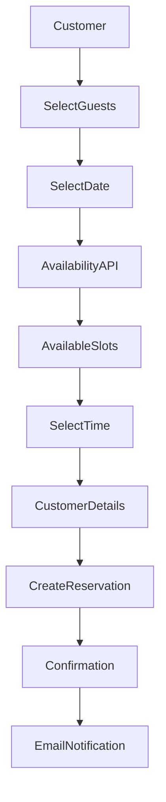

# Restaurant Booking Platform — Project Specifications

🍽️ **Restaurant Table Reservation and Online Ordering System**

---

## 📌 Problem

Many restaurants manage reservations through phone calls, WhatsApp messages, spreadsheets, or handwritten notes.

This creates several problems:

* Double bookings
* Missed reservations
* Unclear table availability
* Slow booking confirmation
* Difficulty managing opening hours
* No centralized customer records
* Manual menu and order management
* Poor visibility into daily business activity

➡️ This platform provides restaurants with one centralized system for managing reservations, tables, availability, menu items, and customer orders.

---

## 👥 Users

| Persona             | Needs                                           |
| ------------------- | ----------------------------------------------- |
| Restaurant Customer | View availability and reserve a table           |
| Restaurant Owner    | Manage reservations, tables, menu, and settings |
| Restaurant Staff    | Confirm bookings and manage daily operations    |
| Restaurant Manager  | Review activity, revenue, bookings, and orders  |

---

## ✨ Core Features

### A) Restaurant Website

The public restaurant website includes:

* Restaurant information
* Opening hours
* Location and contact details
* Food menu
* Menu categories
* Featured dishes
* Table booking call-to-action
* Mobile-responsive design
* Arabic and English support
* Dark and light modes

---

### B) Table Reservations

Customers can:

* Select a booking date
* View available time slots
* Choose the number of guests
* Enter contact information
* Add special requests
* Confirm a reservation
* View booking details
* Cancel a reservation
* Reschedule a reservation

Reservation statuses:

* Pending
* Confirmed
* Cancelled
* Completed
* No-show

---

### C) Availability System

The platform calculates availability using:

* Restaurant opening hours
* Booking duration
* Time-slot duration
* Number of guests
* Table capacities
* Existing reservations
* Blocked dates and times
* Restaurant capacity

Example:

```text
Date: July 25, 2026
Guests: 4

Available:
5:00 PM
5:30 PM
7:30 PM
8:00 PM
```

Unavailable time slots should not appear to customers.

---

### D) Table Management

Restaurant staff can:

* Create restaurant tables
* Assign table names or numbers
* Set seating capacity
* Activate or deactivate tables
* View current table availability
* Assign reservations to tables

Example tables:

```text
Table 1 — 2 guests
Table 2 — 4 guests
Table 3 — 4 guests
Table 4 — 6 guests
VIP Table — 8 guests
```

---

### E) Business Management Panel

The admin dashboard includes:

* Daily reservation overview
* Upcoming reservations
* Pending booking requests
* Confirmed reservations
* Cancelled reservations
* Customer information
* Table assignments
* Opening-hours management
* Blocked-date management
* Menu management
* Order management
* Restaurant settings
* Staff account management

---

### F) Booking Calendar

Restaurant staff can view reservations using:

* Daily view
* Weekly view
* Monthly view
* Table-based view
* Status filters
* Guest-count filters

Calendar actions:

* Confirm booking
* Cancel booking
* Reschedule booking
* Change assigned table
* Mark customer as arrived
* Mark booking as completed
* Mark customer as no-show

---

### G) Booking Confirmation

After creating a reservation, customers receive:

* Confirmation screen
* Unique confirmation code
* Reservation date
* Reservation time
* Number of guests
* Restaurant location
* Cancellation link

Notification methods:

* Email confirmation
* Optional SMS confirmation
* Optional WhatsApp confirmation

---

### H) Restaurant Menu

Restaurant managers can manage:

* Menu categories
* Menu items
* Prices
* Item images
* Descriptions
* Availability
* Featured items
* Dietary information
* Preparation time

Example categories:

* Appetizers
* Main Courses
* Burgers
* Drinks
* Desserts

---

### I) Online Ordering

Customers can:

* Browse menu items
* Search the menu
* Filter by category
* Add items to cart
* Change item quantities
* Add order notes
* Choose pickup or delivery
* Submit an order
* View order confirmation
* Track order status

Order statuses:

* Pending
* Confirmed
* Preparing
* Ready
* Out for delivery
* Completed
* Cancelled

---

### J) Authentication and Authorization

Authentication methods:

* Email and password
* Password reset
* Optional Google login

User roles:

```text
OWNER
MANAGER
STAFF
```

Permissions should be role-based.

| Action                     | Owner | Manager | Staff   |
| -------------------------- | ----- | ------- | ------- |
| Manage restaurant settings | ✅     | ❌       | ❌       |
| Manage staff accounts      | ✅     | ❌       | ❌       |
| Manage menu                | ✅     | ✅       | Limited |
| Manage reservations        | ✅     | ✅       | ✅       |
| View analytics             | ✅     | ✅       | Limited |
| Manage orders              | ✅     | ✅       | ✅       |

Customers do not need an account for the initial MVP.

---

## 🗄️ Data Model

> This Prisma schema is an initial draft and can evolve during development.

```prisma
enum UserRole {
  OWNER
  MANAGER
  STAFF
}

enum ReservationStatus {
  PENDING
  CONFIRMED
  CANCELLED
  COMPLETED
  NO_SHOW
}

enum OrderType {
  PICKUP
  DELIVERY
}

enum OrderStatus {
  PENDING
  CONFIRMED
  PREPARING
  READY
  OUT_FOR_DELIVERY
  COMPLETED
  CANCELLED
}

model User {
  id           String   @id @default(cuid())
  name         String
  email        String   @unique
  passwordHash String
  role         UserRole @default(STAFF)

  restaurantId String
  restaurant   Restaurant @relation(fields: [restaurantId], references: [id])

  createdAt DateTime @default(now())
  updatedAt DateTime @updatedAt

  @@index([restaurantId])
}

model Restaurant {
  id          String  @id @default(cuid())
  name        String
  slug        String  @unique
  description String?
  phone       String?
  email       String?
  address     String?
  logoUrl     String?
  coverUrl    String?

  timezone           String @default("Asia/Riyadh")
  slotDurationMinutes Int    @default(30)
  bookingDurationMinutes Int @default(90)

  users          User[]
  tables         RestaurantTable[]
  businessHours  BusinessHour[]
  blockedPeriods BlockedPeriod[]
  reservations   Reservation[]
  menuCategories MenuCategory[]
  orders         Order[]

  createdAt DateTime @default(now())
  updatedAt DateTime @updatedAt
}

model RestaurantTable {
  id       String  @id @default(cuid())
  name     String
  capacity Int
  isActive Boolean @default(true)

  restaurantId String
  restaurant   Restaurant @relation(fields: [restaurantId], references: [id])

  reservations Reservation[]

  createdAt DateTime @default(now())
  updatedAt DateTime @updatedAt

  @@index([restaurantId])
}

model BusinessHour {
  id              String  @id @default(cuid())
  dayOfWeek       Int
  opensAtMinutes  Int
  closesAtMinutes Int
  isClosed        Boolean @default(false)

  restaurantId String
  restaurant   Restaurant @relation(fields: [restaurantId], references: [id])

  @@unique([restaurantId, dayOfWeek])
}

model BlockedPeriod {
  id      String   @id @default(cuid())
  startAt DateTime
  endAt   DateTime
  reason  String?

  restaurantId String
  restaurant   Restaurant @relation(fields: [restaurantId], references: [id])

  @@index([restaurantId, startAt, endAt])
}

model Customer {
  id    String @id @default(cuid())
  name  String
  email String?
  phone String

  reservations Reservation[]
  orders       Order[]

  createdAt DateTime @default(now())
  updatedAt DateTime @updatedAt

  @@index([phone])
  @@index([email])
}

model Reservation {
  id               String            @id @default(cuid())
  confirmationCode String            @unique @default(cuid())
  guests           Int
  startAt          DateTime
  endAt            DateTime
  status           ReservationStatus @default(PENDING)
  notes            String?

  restaurantId String
  restaurant   Restaurant @relation(fields: [restaurantId], references: [id])

  tableId String?
  table   RestaurantTable? @relation(fields: [tableId], references: [id])

  customerId String
  customer   Customer @relation(fields: [customerId], references: [id])

  createdAt DateTime @default(now())
  updatedAt DateTime @updatedAt

  @@index([restaurantId, startAt])
  @@index([tableId, startAt, endAt])
  @@index([customerId])
}

model MenuCategory {
  id          String  @id @default(cuid())
  name        String
  description String?
  position    Int     @default(0)
  isActive    Boolean @default(true)

  restaurantId String
  restaurant   Restaurant @relation(fields: [restaurantId], references: [id])

  items MenuItem[]

  createdAt DateTime @default(now())
  updatedAt DateTime @updatedAt

  @@index([restaurantId])
}

model MenuItem {
  id          String  @id @default(cuid())
  name        String
  description String?
  price       Decimal @db.Decimal(10, 2)
  imageUrl    String?
  isAvailable Boolean @default(true)
  isFeatured  Boolean @default(false)

  categoryId String
  category   MenuCategory @relation(fields: [categoryId], references: [id])

  orderItems OrderItem[]

  createdAt DateTime @default(now())
  updatedAt DateTime @updatedAt

  @@index([categoryId])
}

model Order {
  id          String      @id @default(cuid())
  orderNumber String      @unique
  type        OrderType
  status      OrderStatus @default(PENDING)
  subtotal    Decimal     @db.Decimal(10, 2)
  deliveryFee Decimal     @default(0) @db.Decimal(10, 2)
  total       Decimal     @db.Decimal(10, 2)
  notes       String?
  address     String?

  restaurantId String
  restaurant   Restaurant @relation(fields: [restaurantId], references: [id])

  customerId String
  customer   Customer @relation(fields: [customerId], references: [id])

  items OrderItem[]

  createdAt DateTime @default(now())
  updatedAt DateTime @updatedAt

  @@index([restaurantId, createdAt])
  @@index([customerId])
}

model OrderItem {
  id       String  @id @default(cuid())
  quantity Int
  unitPrice Decimal @db.Decimal(10, 2)
  notes    String?

  orderId String
  order   Order @relation(fields: [orderId], references: [id])

  menuItemId String
  menuItem   MenuItem @relation(fields: [menuItemId], references: [id])

  @@index([orderId])
  @@index([menuItemId])
}
```

---

## 🧱 Technology Stack

| Category           | Choice                                      |
| ------------------ | ------------------------------------------- |
| Frontend           | Next.js with React                          |
| Language           | TypeScript                                  |
| Backend            | NestJS                                      |
| Database           | PostgreSQL                                  |
| ORM                | Prisma                                      |
| CSS                | Tailwind CSS v4                             |
| UI Components      | shadcn/ui                                   |
| Forms              | React Hook Form                             |
| Validation         | Zod on frontend, class-validator on backend |
| Authentication     | JWT with refresh tokens                     |
| Password Security  | Argon2                                      |
| Date Handling      | date-fns                                    |
| API Documentation  | Swagger                                     |
| Image Storage      | Cloudinary or Cloudflare R2                 |
| Email              | Resend                                      |
| Deployment         | Vercel for frontend                         |
| Backend Deployment | Railway, Render, or Fly.io                  |
| Database Hosting   | Neon or Railway PostgreSQL                  |
| Monitoring         | Sentry later                                |

---

## 🏗️ Application Structure

The frontend and backend are two independent projects.

```text
Projects/
├── booking-web/
│   ├── src/
│   │   ├── app/
│   │   ├── components/
│   │   ├── features/
│   │   ├── hooks/
│   │   ├── lib/
│   │   └── types/
│   └── package.json
│
└── booking-api/
    ├── src/
    │   ├── auth/
    │   ├── users/
    │   ├── restaurants/
    │   ├── reservations/
    │   ├── availability/
    │   ├── tables/
    │   ├── menu/
    │   ├── orders/
    │   ├── customers/
    │   └── common/
    ├── prisma/
    └── package.json
```

This is not an Nx workspace or monorepo. Each application has its own dependencies, environment variables, Git repository, and deployment.

---

## 🎨 UI and UX

### Design Direction

* Clean restaurant-focused interface
* Modern and welcoming visual design
* Mobile-first booking experience
* Simple reservation flow
* Clear availability feedback
* Accessible form controls
* Arabic RTL support
* English LTR support
* Dark and light modes

### Inspiration

* OpenTable
* Resy
* Airbnb booking flows
* Linear-style management panels
* Modern restaurant websites

---

## 🧭 Public Website Layout

```text
Navbar
Hero section
Featured menu items
About the restaurant
Reservation section
Opening hours
Location
Customer reviews
Footer
```

### Main Customer Pages

```text
/
├── menu
├── reservations
├── reservations/confirmation/[code]
├── reservations/manage/[code]
├── cart
├── checkout
└── orders/[orderNumber]
```

---

## 🧭 Admin Panel Layout

```text
/admin
├── dashboard
├── reservations
├── calendar
├── tables
├── menu
├── orders
├── customers
├── staff
└── settings
```

### Sidebar Navigation

* Dashboard
* Reservations
* Calendar
* Tables
* Menu
* Orders
* Customers
* Staff
* Settings

---

## 🔌 API Architecture



---

## 🔐 Authentication Flow



The access token should be short-lived.

The refresh token should be stored securely using an HTTP-only cookie.

Sensitive values must remain on the backend:

* Database URL
* JWT secret
* Refresh-token secret
* Email API key
* Cloud storage secret
* Payment secret

Never expose secrets using `NEXT_PUBLIC_` environment variables.

---

## 📅 Reservation Flow



---

## 🕒 Availability Logic

The availability service should:

1. Read the restaurant's opening hours.
2. Check whether the selected date is blocked.
3. Generate available booking slots.
4. Remove slots outside business hours.
5. Find tables that support the requested guest count.
6. Check existing reservations for overlapping times.
7. Return only slots with at least one available table.

Two bookings overlap when:

```text
existingStart < requestedEnd
AND
existingEnd > requestedStart
```

The final availability check must run again when creating the reservation to prevent double booking.

---

## 🔗 Initial API Endpoints

### Authentication

```text
POST   /auth/login
POST   /auth/refresh
POST   /auth/logout
GET    /auth/me
```

### Restaurants

```text
GET    /restaurants/:slug
PATCH  /restaurants/:id
GET    /restaurants/:id/settings
PATCH  /restaurants/:id/settings
```

### Availability

```text
GET /restaurants/:id/availability
```

Example query:

```text
GET /restaurants/restaurant-id/availability?date=2026-07-25&guests=4
```

### Reservations

```text
POST   /reservations
GET    /reservations/:confirmationCode
PATCH  /reservations/:id/confirm
PATCH  /reservations/:id/cancel
PATCH  /reservations/:id/reschedule
PATCH  /reservations/:id/complete
PATCH  /reservations/:id/no-show
GET    /admin/reservations
```

### Tables

```text
POST   /tables
GET    /tables
GET    /tables/:id
PATCH  /tables/:id
DELETE /tables/:id
```

### Menu

```text
POST   /menu/categories
GET    /menu/categories
PATCH  /menu/categories/:id
DELETE /menu/categories/:id

POST   /menu/items
GET    /menu/items
GET    /menu/items/:id
PATCH  /menu/items/:id
DELETE /menu/items/:id
```

### Orders

```text
POST   /orders
GET    /orders/:orderNumber
GET    /admin/orders
PATCH  /orders/:id/status
```

---

## 📊 Dashboard Metrics

The management dashboard can display:

* Reservations today
* Confirmed reservations
* Pending reservations
* Cancelled reservations
* Total guests today
* Upcoming bookings
* Orders today
* Revenue today
* Popular menu items
* No-show rate
* Peak reservation times

---

## 📱 Responsive Requirements

### Mobile

* Booking form should fit within one column
* Calendar should remain touch-friendly
* Available slots should use large buttons
* Admin sidebar should become a drawer
* Tables should become cards where necessary

### Desktop

* Persistent admin sidebar
* Multi-column dashboard
* Calendar and reservation list side by side
* Table management grid
* Detailed reservation panels

---

## ♿ Accessibility

* Keyboard-accessible forms
* Visible focus states
* Accessible labels
* Sufficient color contrast
* Semantic HTML
* Accessible dialogs
* Clear error messages
* Screen-reader-friendly status updates

---

## 🧪 Testing

### Backend

* Unit tests for availability calculations
* Unit tests for reservation conflicts
* Authentication tests
* Reservation API integration tests
* Order-total calculation tests

### Frontend

* Booking form validation
* Available-time selection
* Booking confirmation display
* Admin reservation filters
* Responsive layout testing

Critical availability logic should receive the highest testing priority.

---

## 🗂️ Development Workflow

Use one Git branch for each major feature.

Examples:

```bash
git switch -c feature/project-setup
git switch -c feature/authentication
git switch -c feature/restaurant-settings
git switch -c feature/table-management
git switch -c feature/availability
git switch -c feature/reservations
git switch -c feature/admin-calendar
git switch -c feature/menu
git switch -c feature/orders
```

Recommended commit examples:

```text
feat: add restaurant table management
feat: implement reservation availability service
feat: create customer booking form
fix: prevent overlapping table reservations
refactor: extract booking validation logic
```

---

## 🧭 Roadmap

### Phase 1 — Project Setup

* Create Next.js application
* Install Tailwind CSS
* Install shadcn/ui
* Create NestJS application
* Configure PostgreSQL
* Configure Prisma
* Add environment validation
* Enable backend CORS
* Add global validation pipe
* Configure Swagger

### Phase 2 — Restaurant Configuration

* Restaurant profile
* Opening hours
* Table management
* Blocked dates and periods
* Booking duration settings

### Phase 3 — Reservation MVP

* Availability endpoint
* Customer booking form
* Create reservation
* Confirmation page
* Admin reservation list
* Confirm and cancel actions

### Phase 4 — Admin Calendar

* Daily reservation view
* Weekly reservation view
* Reservation filters
* Table assignments
* Rescheduling
* No-show tracking

### Phase 5 — Menu

* Menu categories
* Menu items
* Images
* Featured dishes
* Availability controls

### Phase 6 — Ordering

* Customer cart
* Checkout form
* Pickup orders
* Order management
* Order-status updates

### Phase 7 — Production Improvements

* Email notifications
* Rate limiting
* API logging
* Error monitoring
* Image uploads
* Arabic translations
* Deployment
* Automated tests

---

## ✅ MVP Scope

The initial portfolio MVP should include:

* Restaurant landing page
* Responsive booking page
* Available-time calculation
* Table reservation creation
* Reservation confirmation
* Reservation cancellation
* Admin login
* Admin dashboard
* Reservation list
* Booking calendar
* Table management
* Opening-hours management

Online ordering can be added after the reservation MVP is stable.

---

## 🚫 Out of Scope for the Initial MVP

* Multiple restaurant branches
* Marketplace for multiple restaurants
* Customer mobile application
* Loyalty points
* Advanced delivery tracking
* Complex payment integration
* Team subscription plans
* AI recommendations

These features can be added later without delaying the core booking system.

---

## 📌 Status

* Project requirements defined
* Frontend setup in progress
* Ready for UI scaffolding
* Backend architecture ready for implementation
* Reservation system selected as the first development milestone

---

🍽️ **Restaurant Booking Platform — Reserve Easily. Manage Efficiently.**
